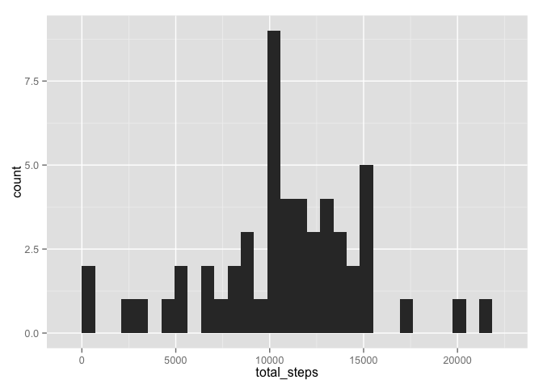
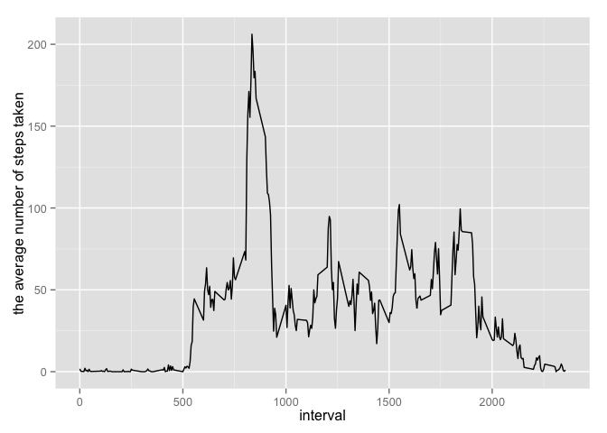
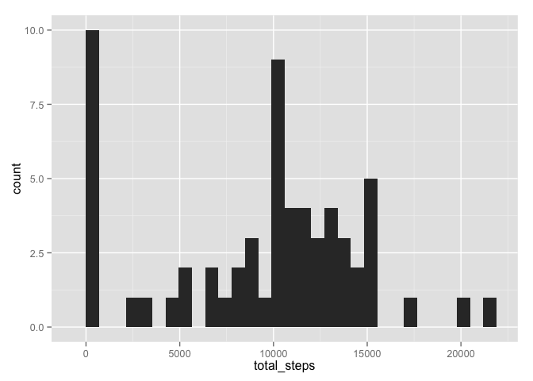
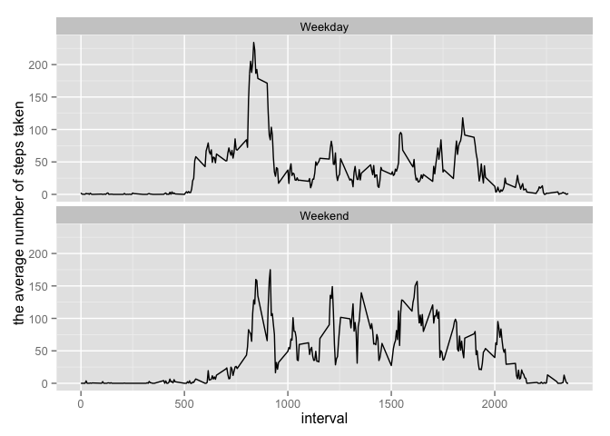

# Reproducible Research: Peer Assessment 1


## Loading and preprocessing the data

1. Load the data

1-1  Create a name for a directory where the zip file is exploded


```r
 zipdir <- tempfile()
```

1-2 Create a directory using that name


```r
 dir.create(zipdir)
```

1-3 From the data zip file in git repository, Unzip the file into the dir


```r
 unzip("~/git/RepData_PeerAssessment1/activity.zip", exdir=zipdir)
```

1-4 Get the files list from the directory


```r
 files <- list.files(zipdir)
```

1-5 Throw an error if there's more than one


```r
if(length(files)>1) stop("More than one data file inside zip")
```

1-6 Get the full name of the file


```r
file <- paste(zipdir, files[1], sep="/")
```

1-7 Read the file


```r
 data <- read.csv(file)
```

## What is mean total number of steps taken per day?

1. Make a histogram of the toal number of steps take each day.  

1-1 Sammarise data by date and compute total number of steps per day


```r
library(dplyr)
data_per_day <- group_by(data,date) %>% summarise(total_steps = sum(steps, na.rm = TRUE))
```

1-2 Then make a histogram 


```r
library(ggplot2)
ggplot(data_per_day, aes(x=total_steps)) + geom_histogram()
```

 

2.Calculate and report the mean and median total number of steps taken per day

2-1 Mean

```r
mean(data_per_day$total_steps)
```

```
## [1] 9354
```

2-2 Median

```r
median(data_per_day$total_steps)
```

```
## [1] 10395
```
## What is the average daily activity pattern?

1. Make a time series plot (i.e. type = "l") of the 5-minute interval (x-axis) and the average number of steps taken, averaged across all days (y-axis)

1-1 First, calculate average number of steps taken, averaged across all days


```r
data_per_interval <- data %>% group_by(interval) %>% summarize(average_steps = mean(steps, na.rm=TRUE))
```

1-2 Plot the time series chart


```r
ggplot(data_per_interval, aes(interval, average_steps)) + geom_line() + 
  xlab("interval") + ylab("the average number of steps taken")
```

 

2. Which 5-minute interval, on average across all the days in the dataset, contains the maximum number of steps?


```r
top_interval <- data_per_interval %>% filter(average_steps == max(average_steps))
head(top_interval, n=1)
```

```
## Source: local data frame [1 x 2]
## 
##   interval average_steps
## 1      835         206.2
```

So the interval 835 contains the maximum number of steps 206.1698. 

## Imputing missing values

1.Calculate and report the total number of missing values in the dataset (i.e. the total number of rows with NAs)


```r
data_na <- subset(data, is.na(steps))
nrow(data_na)
```

```
## [1] 2304
```

2.Devise a strategy for filling in all of the missing values in the dataset. The strategy does not need to be sophisticated. For example, you could use the mean/median for that day, or the mean for that 5-minute interval, etc.

So, lets use mean for the day to fill the missing values. So median per day can calcuate like this.


```r
medDF <- data %>% group_by(date) %>% summarize(mean = mean(steps,na.rm = TRUE))
```

If calculated mean is still na, then fill it wize 0.


```r
medDF$mean[is.na(medDF$mean)] <- 0
```

3.Create a new dataset that is equal to the original dataset but with the missing data filled in.

Find the na and fill it with mean from medDF by matching date


```r
 data_filled <- data
 data_filled$steps[is.na(data_filled$steps)] <- medDF$mean[match(data_filled$date,medDF$date)][is.na(data_filled$steps)]
```

4.Make a histogram of the total number of steps taken each day and Calculate and report the mean and median total number of steps taken per day. Do these values differ from the estimates from the first part of the assignment? What is the impact of imputing missing data on the estimates of the total daily number of steps?

4-1 Sammarise data by date and compute total number of steps per day


```r
data_filled_per_day <- group_by(data_filled,date) %>% summarise(total_steps = sum(steps, na.rm = TRUE))
```

4-2 Then make a histogram 


```r
ggplot(data_filled_per_day, aes(x=total_steps)) + geom_histogram()
```

 


4-3 Mean of total number of steps taken per day.

```r
mean(data_filled_per_day$total_steps)
```

```
## [1] 9354
```

4-4 Median of total number of steps take per day.

```r
median(data_filled_per_day$total_steps)
```

```
## [1] 10395
```

4-5 Do these values differ from the estimates from the first part of the assignment? 

As for mean the value (9354.2295), it does not differ from the estimate (9354.2295) from the first part of the assignment

As for median the value (1.0395 &times; 10<sup>4</sup>), it does not differ from the estimate (10395) from the first part of the assignment.

## Are there differences in activity patterns between weekdays and weekends?

1.Create a new factor variable in the dataset with two levels – “weekday” and “weekend” indicating whether a given date is a weekday or weekend day.

1.1 mutate data set to append a new column for weekday


```r
data_category <- data %>% mutate(weekday = weekdays(strptime(date,format="%Y-%m-%d")))
```

1.2 set type (either Weekday or Weekend) based on the weekday calculated at previous step.


```r
data_category$type[data_category$weekday != 'Sunday' & data_category$weekday != 'Saturday'] <- 'Weekday'
data_category$type[data_category$weekday == 'Sunday' | data_category$weekday == 'Saturday'] <- 'Weekend'
```

2.Make a panel plot containing a time series plot (i.e. type = "l") of the 5-minute interval (x-axis) and the average number of steps taken, averaged across all weekday days or weekend days (y-axis). The plot should look something like the following, which was creating using simulated data:

2.1 calculate average number of steps taken, average across all weekday days or weekend days


```r
data_per_interval_by_weektype <- data_category %>% group_by(interval,type) %>% summarize(average_steps = mean(steps, na.rm=TRUE))
```

2.2 Make a panel plot containingtime series plots


```r
ggplot(data_per_interval_by_weektype, aes(interval, average_steps)) + geom_line() + 
  facet_wrap(~ type, nrow = 2, ncol = 1) +
  xlab("interval") + ylab("the average number of steps taken")
```

 

